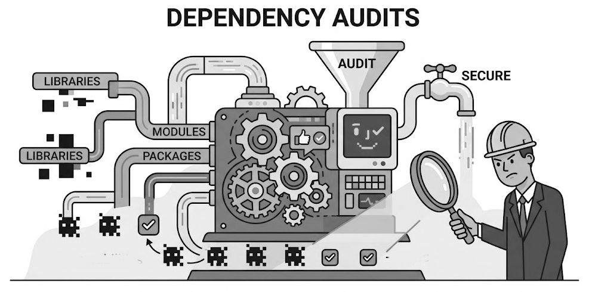

# DependencyAudits.jl




Audit source code dependencies for the correctness of the files listed in Project.toml.
Useful to assist in creating a Project.toml for an existing code base. Running ``auditreport(auditdependencies())`` 
will print a report on the code directory tree's .jl files and connect their dependency use with the
base directory's Project.toml file. The report produces a printed analysis, made with the JuliaSyntax module, of
several key features of your Julia code's dependencies, including examples of lines yet to be placed in 
Project.toml and reports of any packages used but not included in your .toml file.

Example:

julia> using DependencyAudits

julia> cd("my code directory")

julia> audit = auditdependencies()

julia> auditreport(audit)

## Functions Reference

```@index
```

```@autodocs

Modules = [DependencyAudits]
```
